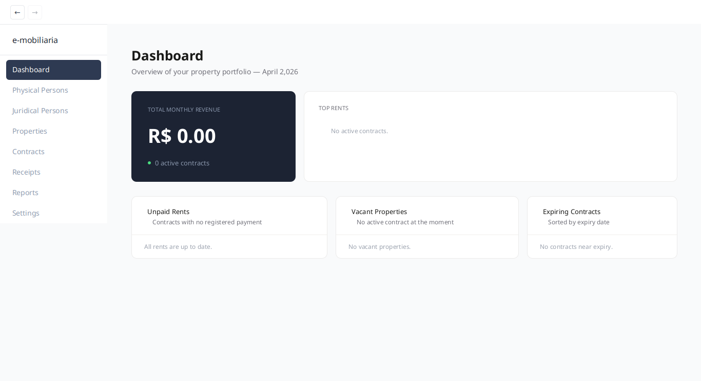
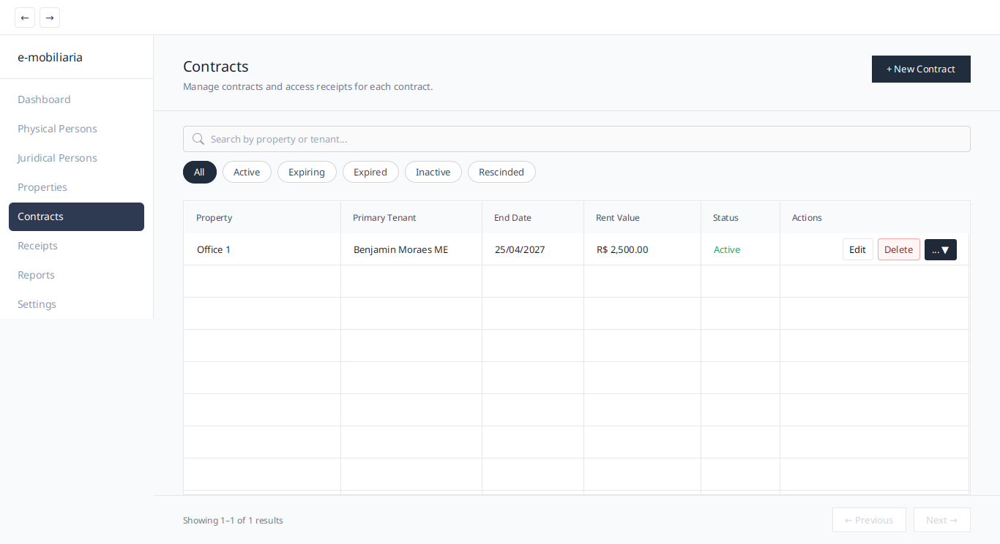
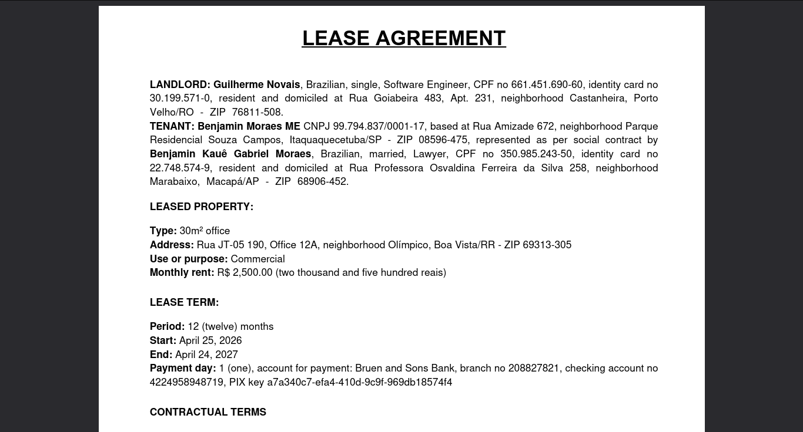
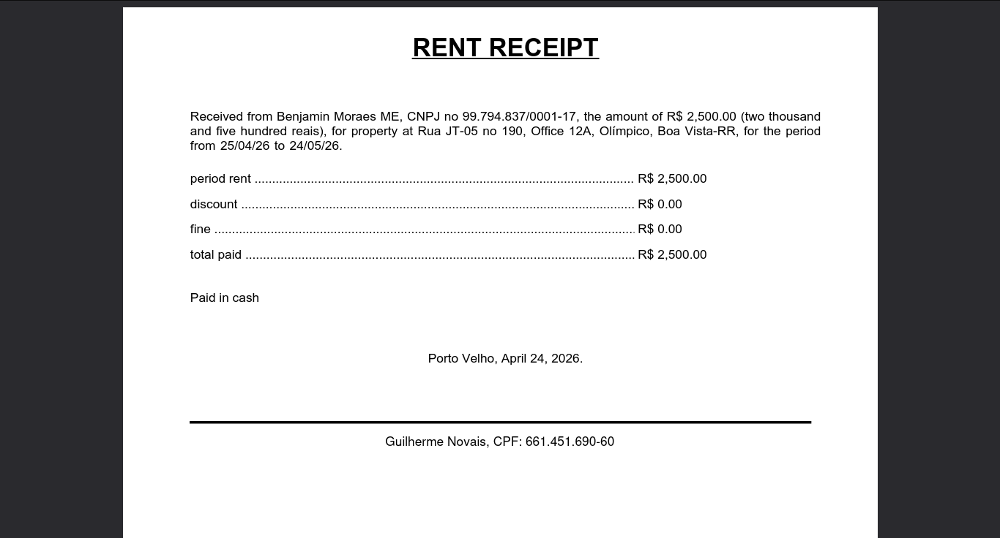

# e-mobiliária

[](https://openjdk.org/)
[](https://openjfx.io/)
[](https://www.gnu.org/licenses/gpl-3.0)

A desktop application for managing property rent contracts. It covers the full lifecycle of a lease: registering
landlords and tenants (physical or juridical persons), managing properties, issuing contracts with configurable payment
terms, generating receipts, and producing financial reports — all exportable to PDF.

---

## Features

- **Initial setup wizard** — first-run configuration to define the default landlord
- **Dashboard** — at-a-glance metrics on active contracts and properties
- **People management** — full CRUD for physical and juridical persons with address data
- **Property management** — register and track residential and commercial properties
- **Contract management** — 8-step creation wizard, configurable rent, duration, payment day, and payment account; PDF
  export
- **Receipt management** — issue receipts with discounts, fines, and observations; PDF export
- **Financial reports** — Rent Evolution and Occupation Rate reports, exported to PDF
- **Settings** — manage application configuration and the default landlord

## Screenshots

> See the full [Screenshots Gallery](SCREENSHOTS.md)

<table>
  <tr>
    <td></td>
    <td></td>
  </tr>
  <tr>
    <td></td>
    <td></td>
  </tr>
</table>

## Tech Stack

| Category             | Technology                |
|----------------------|---------------------------|
| Language             | Java 24                   |
| UI Framework         | JavaFX 21.0.6             |
| Dependency Injection | Google Guice 7            |
| Database             | H2 (embedded)             |
| Connection Pool      | HikariCP 7                |
| Database Migrations  | Flyway 11                 |
| PDF Generation       | JasperReports 7 + OpenPDF |
| Charts               | JFreeChart 1.5.5          |
| Build Tool           | Maven 3                   |

## Prerequisites

- **Java 24** or later ([download](https://openjdk.org/))
- **Maven 3** (or use the included `./mvnw` wrapper — no installation needed)

## Build & Run

```bash
# Run the application in development mode
./mvnw clean javafx:run

# Build a distributable package
./mvnw clean package
```

The built package is generated in the `target/` directory.

## License

This project is licensed under the **GNU General Public License v3.0**.
See the [LICENSE](LICENSE) file for details.
