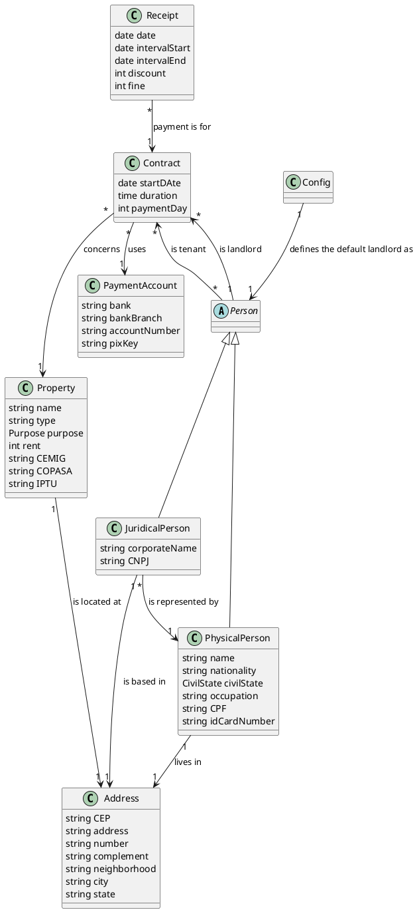

# General instructions

## Overview

- This is a desktop app to manage property lease contracts. It is developed with Java 24 and uses the JavaFX UI
  framework.

## Architecture

- Package-by-Feature + Internal layers:

```
src/main/java/com/guilherme/emobiliaria/
├─ <feature>/                 // Module for <feature> (vertical slices). Each feature contains its own layers.
│
│  ├─ domain/               // Pure business logic. No framework or UI dependencies.
│  │  ├─ entity/            // Core domain models and aggregates.
│  │  ├─ service/           // Domain service interfaces
│  │  └─ repository/        // Repository interfaces (domain contracts for persistence).
│  │
│  ├─ application/          // Application layer orchestrating use cases.
│  │  ├─ input/             // Input of the usecases
│  │  ├─ usecase/           // Use case implementations coordinating domain logic.
│  │  └─ output/            // Output of the usecases
│  │
│  ├─ infrastructure/       // Technical implementations of domain contracts.
│  │  ├─ repository/        // Repository implementations.
│  │  └─ service/           // Domain service implementations.
│  │
│  ├─ di/                   // Feature dependency injection configuration.
│  │
│  └─ ui/                   // JavaFX presentation layer specific to this feature.
│     ├─ controller/        // JavaFX controllers handling UI events and invoking use cases.
│     ├─ component/         // Feature-specific reusable JavaFX components/custom nodes.
│     └─ view/              // FXML views associated with this feature.
│
└─ shared/                  // Cross-feature reusable utilities and UI elements.
    ├─ pdf/                 // Where the PDF generation implementation lives.
    └─ ui/                  // Shared presentation resources used by multiple features.
        ├─ component/       // Generic reusable UI components (buttons, cards, controls).
        ├─ layout/          // Shared layout containers/templates (shells, panels, wrappers).
        └─ style/           // Global stylesheets (CSS), themes, and UI styling resources.
```

### Responsabilities

- The domain and application layers should be pure Java. They should never depend on any UI or persistence framework.
- The application, infrastructure and UI layers should never enforce business rules. This is the job of the domain
  layer.
- The application layer usecases should only orchestrate the domain repositories, services and entities.

## Entities PlantUML diagram



## Dependency Injection

- This project uses **Google Guice 7** for dependency injection.
- The `Injector` is created once in `EMobiliariaApplication.init()` using `AppModule` as the root module.

### Module structure

- **`AppModule`** (`shared/di/AppModule.java`) is the root module. It installs one feature sub-module per feature.
- **Feature modules** live at `<feature>/di/<Feature>Module.java` (e.g., `person/di/PersonModule.java`).
- Each feature module binds domain repository interfaces and domain service interfaces to their infrastructure
  implementations:
  ```java
  bind(PhysicalPersonRepository.class).to(JdbcPhysicalPersonRepository.class);
  ```
- When an infrastructure implementation is added, add its `bind()` call to the corresponding feature module and open the
  new package to `com.google.guice` in `module-info.java`.

### Constructor injection rules

- Annotate every interactor and infrastructure class constructor with `@jakarta.inject.Inject`.
- **Never use field injection.** Constructor injection keeps classes testable without Guice.
- Concrete in-memory domain services (e.g., `CpfValidationService`, `CnpjValidationService`) require no explicit
  `bind()` call — Guice resolves them via just-in-time binding.

### JavaFX controller injection

- All FXML loading must go through `GuiceFxmlLoader` (`shared/di/GuiceFxmlLoader.java`).
- Never use `new FXMLLoader(...)` directly — it bypasses injection.
- `GuiceFxmlLoader` sets `injector::getInstance` as the controller factory, so Guice instantiates controllers and
  resolves all their constructor dependencies.
- UI controller packages must be opened to both `javafx.fxml` and `com.google.guice` in `module-info.java`:
  ```java
  opens com.guilherme.emobiliaria.<feature>.ui.controller to javafx.fxml, com.google.guice;
  ```
