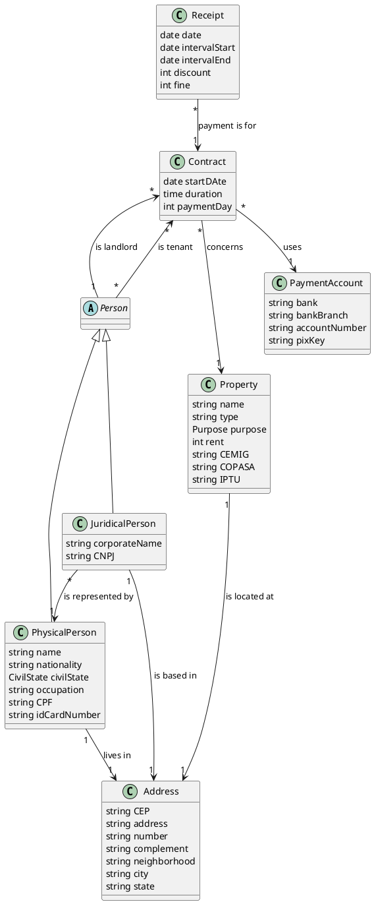

# E-mobiliaria repository instructions

## Overview

- This is a desktop app to manage property lease contracts. It is developed with Java 24 and uses the JavaFX UI
  framework.

## Architecture

- Package-by-Feature + Internal layers:

```
src/main/java/com/guilherme/emobiliaria/
├─ <feature>/                 // Module for <feature> (vertical slices). Each feature contains its own layers.
│
│  ├─ domain/               // Pure business logic. No framework or UI dependencies.
│  │  ├─ entity/            // Core domain models and aggregates.
│  │  ├─ service/           // Domain service interfaces
│  │  └─ repository/        // Repository interfaces (domain contracts for persistence).
│  │
│  ├─ application/          // Application layer orchestrating use cases.
│  │  ├─ input/             // Input of the usecases
│  │  ├─ usecase/           // Use case implementations coordinating domain logic.
│  │  └─ output/            // Output of the usecases
│  │
│  ├─ infrastructure/       // Technical implementations of domain contracts.
│  │  ├─ repository/        // Repository implementations.
│  │  └─ service/           // Domain service implementations.
│  │
│  └─ ui/                   // JavaFX presentation layer specific to this feature.
│     ├─ controller/        // JavaFX controllers handling UI events and invoking use cases.
│     ├─ component/         // Feature-specific reusable JavaFX components/custom nodes.
│     └─ view/              // FXML views associated with this feature.
│
└─ shared/                  // Cross-feature reusable utilities and UI elements.
    ├─ pdf/                 // Where the PDF generation implementation lives.
    └─ ui/                  // Shared presentation resources used by multiple features.
        ├─ component/       // Generic reusable UI components (buttons, cards, controls).
        ├─ layout/          // Shared layout containers/templates (shells, panels, wrappers).
        └─ style/           // Global stylesheets (CSS), themes, and UI styling resources.
```

### Responsabilities

- The domain and application layers should be pure Java. They should never depend on any UI or persistence framework.
- The application, infrastructure and UI layers should never enforce business rules. This is the job of the domain
  layer.
- The application layer usecases should only orchestrate the domain repositories, services and entities.

## Entities PlantUML diagram


